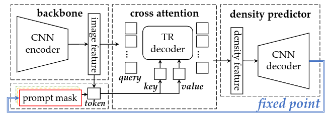

# fixedpoint_prompt_counting
Official code for AAAI-24 paper:"A Fixed-Point Approach to Unified Prompt-Based Counting"

> The **motivation** is to propose a unified framework for prompt-based counting, which is able to handle both box, point and text prompts.
> 

> The **pipeline** of the proposed method is as follows:



# Requirement

We use [Singularity](https://docs.sylabs.io/guides/3.3/user-guide/index.html) to build the enviroment. Download our enviroment: [excalibur.sif](https://portland-my.sharepoint.com/:u:/g/personal/wlin38-c_my_cityu_edu_hk/ESJUgH4yrsxPoZlOEfA9dCYBweBOif4vKVsBgRNqJH6E8Q?e=lWuBJH).
If you'd like to create environement yourself, the following python packages are required:
```
pytorch == 1.9.0
torchvision == 0.10.0
timm == 0.4.12
termcolor
yacs
einops
```

# Data Preparation

1. Download [FSC-147](https://github.com/cvlab-stonybrook/LearningToCountEverything);
2. modify the following parameters in `data_fsc147/prepare_data.sh`:
    - Let `ori_root` be the local path of FSC-147.
    - Let `new_root` be the path that you want to save the modified FSC-147.
3. execute the script: 
```shell
cd data_fsc147
bash prepare_data.sh
```

# Training

- set the `data_path` in `run.sh` the same as `new_root` in `data_fsc147/prepare_data.sh`
- If you use our singularity: `singularity exec --bind  --nv path_to_excalibur.sif ./run.sh`
- If you create the environment yourself, just execute the script: `./run.sh`

A training log is shown in `md-files/training.log`, and corresponding checkpoint `fxp.pth` is uploaded [here](https://github.com/Elin24/fixedpoint_prompt_counting/releases/tag/checkpoint).

# Citation
```
@inproceedings{lin2024fixed,
  title={A Fixed-Point Approach to Unified Prompt-Based Counting},
  author={Lin, Wei and Chan, Antoni B},
  booktitle={Proceedings of the AAAI Conference on Artificial Intelligence},
  volume={38},
  number={4},
  pages={3468--3476},
  year={2024}
}
```
